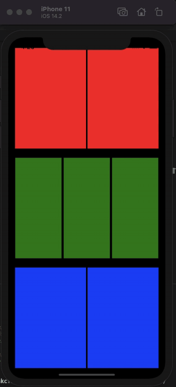

# React Native Coachmark



This is forked from [traveloka/react-native-coachmark](https://github.com/traveloka/react-native-coachmark) with addition skip button.

## Installation

Since npm and yarn give different result in package.json,
please use npm installation method if you installing from github.

yarn

```
yarn add react-native-coachmark
```

npm

```
npm i react-native-coachmark --save
```

## Getting Started

### Basic Usage

```javascript
import React from 'react';
import { Coachmark } from 'react-native-coachmark';

export default function AwesomeScreen() {
  return (
    <Page>
      <Header>
        <Coachmark autoShow message="Click here to save your page!">
          <ButtonBookmark>
        </Coachmark>
      </Header>
    </Page>
  );
}
```

## Documentation

### - Coachmark

#### Importing

```javascript
var Coachmark = require('react-native-coachmark').Coachmark; // ES5

import { Coachmark } from 'react-native-coachmark'; // ES6
```

#### Props

| Property      | Type     | Default Value | Description                                    |
| ------------- | -------- | ------------- | ---------------------------------------------- |
| message       | string   | none          | required                                       |
| autoShow      | boolean  | none          | to show the coachmark when mounting            |
| onShow        | function | none          | will be called when coachmark is showing       |
| onHide        | function | none          | will be called when coachmark is hidden        |
| onSkip        | function | none          | will be called when coachmark is skipped       |
| isAnchorReady | boolean  | true          | a value to force coachmark not being shown yet |
| skipable      | boolean  | false         | a value to force coachmark not being shown yet |

#### Methods

| Methods             | Description                              |
| ------------------- | ---------------------------------------- |
| `show() => Promise` | a function to trigger show the coachmark |

### Roadmap

- [ ] Auto load and save in AsyncStorage
- [x] Show coachmark only when in view port
- [ ] Custom render arrow and content

## Contributing

We'd to have your helping hand on this package! Feel free to PR's, add issues or give feedback!

## Credits

- [Jacky Wijaya](https://www.linkedin.com/in/jacky-wijaya-125b90b6/) (jekiwijaya) at Traveloka.
- [Bramanditya Adi Prabowo](https://www.linkedin.com/in/bramanditya-adi-prabowo) (Pholenk) at BookingToGo.
